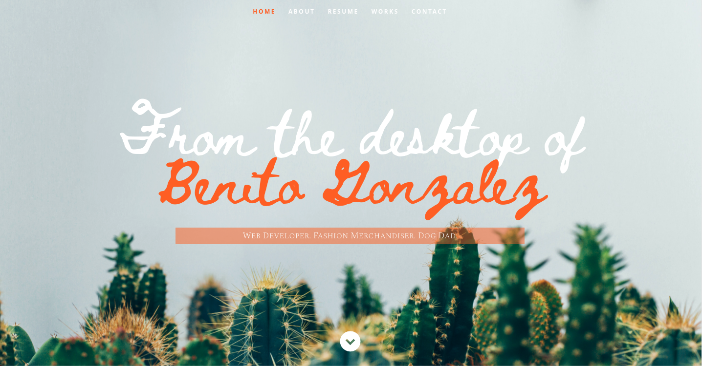

# **Benito Gonzalez Portfolio**

## Description
Professional portfolio for Benito Gonzalez

**Links to [GitHub Repo](https://github.com/ohnobenito/react-portfilio) and [Deployed Page](https://ohnobenito.github.io/react-portfolio/)**

## Table of Contents
[1. Description](#Description) 
[2. License](License) 
[3. Credits](#Credits) 
[4. Questions](#Questions) 

## License
This application is covered by the MIT license. Full documentation can be found [here](https://choosealicense.com/licenses/mit).

## Credits
Modified Template Design by [nordicgiant2](https://github.com/nordicgiant2/react-nice-resume), originally created by [tbakerx](https://github.com/tbakerx/react-resume-template).

Heading Background photo by [Thomas Verburggen](https://unsplash.com/photos/5A06OWU6Wuc).

## Questions
Follow me on GitHub here: [Github](https://www.github.com/Ohnobenito) 
Have additional questions? Contact Benito Gonzalez by email: ohnobenito@gmail.com
